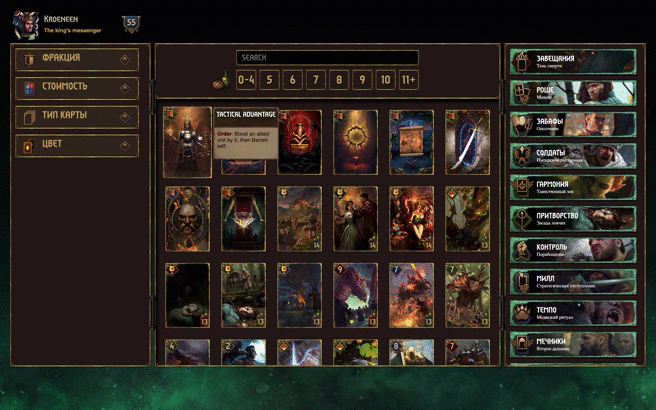
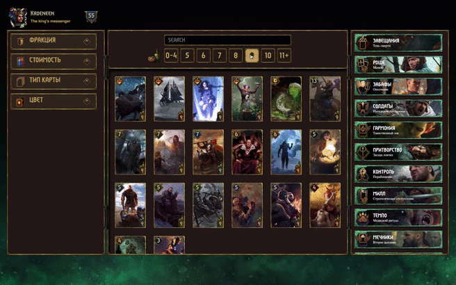
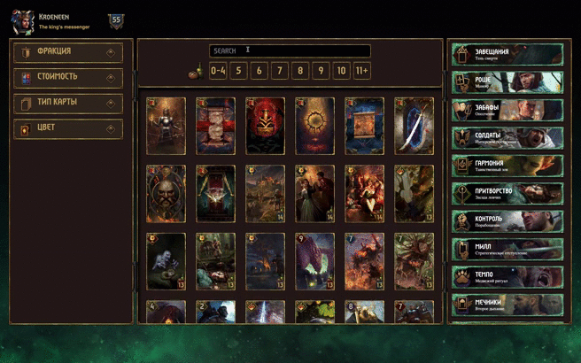
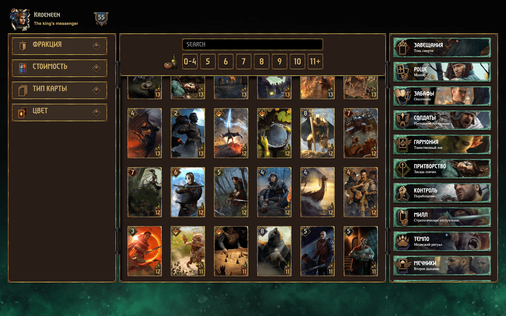
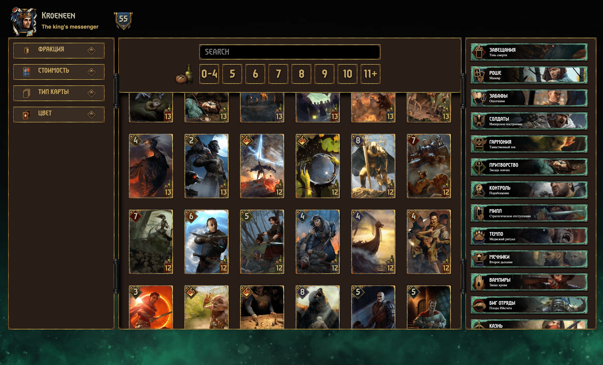
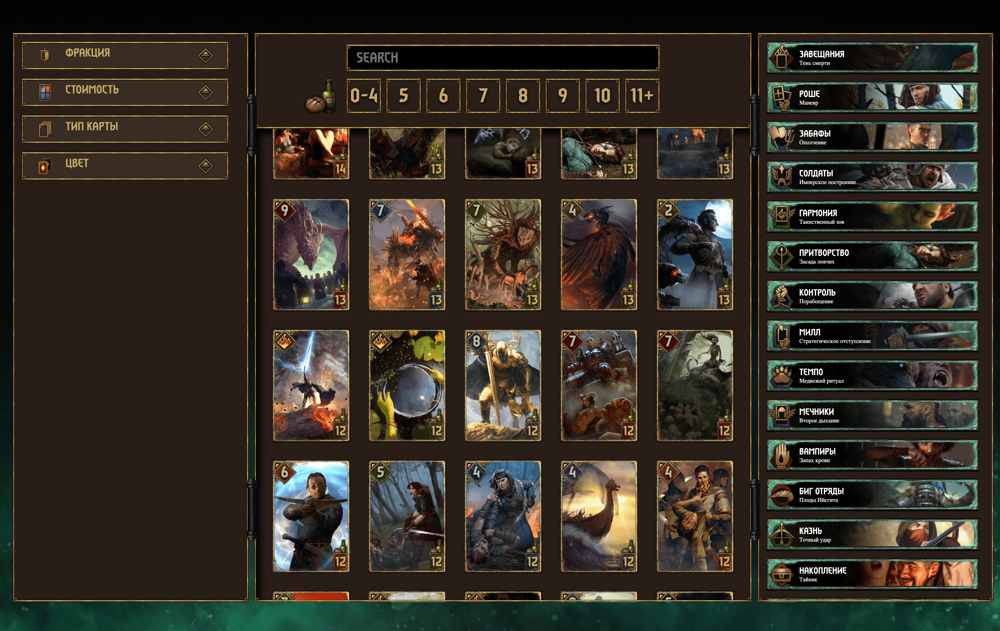
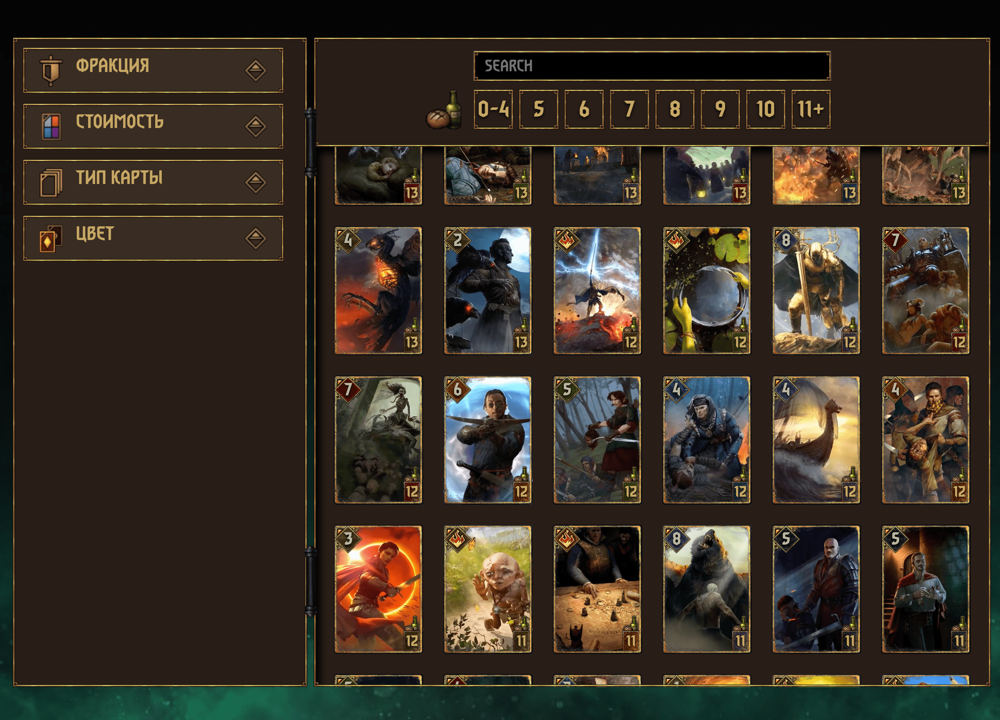
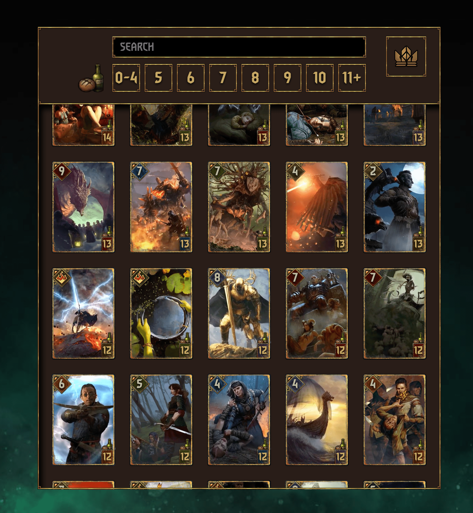
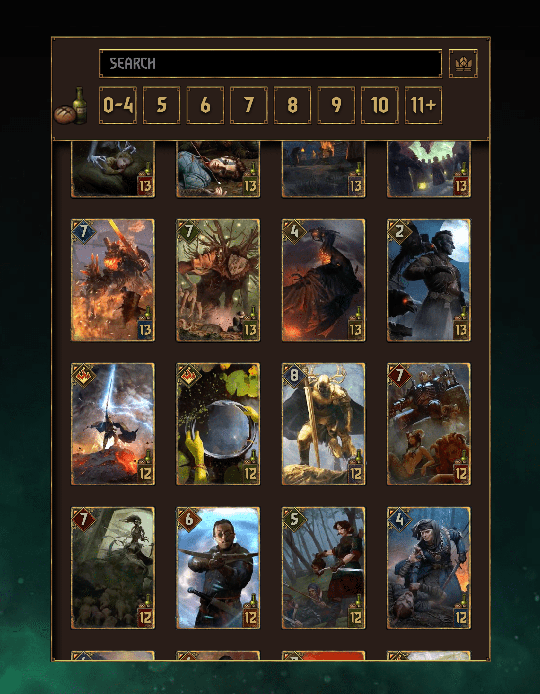

  
  
    
  
  

<h2 align="center">Description</h2>

In this template, you can see a large list of different cards, each of which has its own personal characteristics (provisions, stats, fraction, bonus, name, description, image). Thanks to internal filters, you can manage this list of cards.
- To launch the app:
  - download the repository;
  - log in to the downloaded repository using the command line or terminal;
  - enter the command line 'npm run start' or 'serve-s build' and go to the address specified in the terminal.

* Note that the project was made using the CREATE REACT APP.
* Also, the app is very loaded (due to the abundance of media files), so it is not recommended for zapupsku on mobile devices, although the site is adapted to small tablet screens.

- I would like to note that this is just a test project that does not claim anything. I made it solely out of personal interest.

#### Use technology.

The following technologies were used to create this project:

<h3 align="center">Software platform</h3>
<!--Software platform start-->

  

<h3 align="center">Preprocessors</h3>

<!--Preprocessors start-->

  

<h3 align="center">Libraries</h3>

<!--Libraries-->

  

<h3 align="center">Package manager</h4>

<!--Package manager-->

  

---

## Documentation

#### The repository of this project is divided into several sections:

- `src` - this repository is intended for files with the help of which the project is being developed. It is from this repository that all project files are compiled;
- `docs` - a repository that stores all compiled code with all media files;

#### The following describes in more detail the repository `src`:

- `app` - this repository is divided into several folders and files:

  - `fonts` - folder is used to store fonts;
  - `image` - all images for the site are stored in the folder;
  - `components` - a repository where all site elements are distributed in modules and stored in separate files and folders;
  - `screens` - it stores the files needed to build the project into a single whole by combining all the components of the site;
  - `variables` - this repository stores global variables and arrays.

- `public` - media files distributed by subgroups are stored inside this repository.

#### This section describes how to work with `Create React App` used in the project:

- `npm run start` - this command starts the project from the local 'src' repository where you work on the entire product;
- `serve -s build` - this command starts the project from the local 'build' repository where the finished and assembled project is located for release in production.

## Appearance

The image of the website:

- Gif
- Images in various screen formats

#### Gif

  - Card hover
  

  - Filter Provision
  

  - Text Filter
  

  - Filtering cards by properties
  

#### Desktop

  - Full screen
  

  - Screen less then 1815 px
  

  - Screen less then 1740 px
  

  - Screen less then 1530 px
  

  - Screen less then 1415 px
  

  - Screen less then 1240 px
  

  - Screen less then 1048 px
  

  - Screen less then 880 px
  